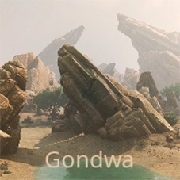
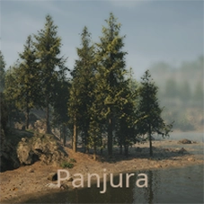

# Path of Titans Map Info

Below you'll find a list of all maps **Path of Titans** offers!

<!-- ## [Aedis](./Path-of-Titans-Aedis) -->

## [Avernus](./Path-of-Titans-Avernus) 

<!-- ## [Beringia](./Path-of-Titans-Beringia.md) -->

## [Cerulean Island](./Path-of-Titans-CeruleanIsland)

<!-- ## [Etis](./Path-of-Titans-Etis) -->

## [Gondwa](./Path-of-Titans-Gondwa)

<!-- ## [Infinita](./Path-of-Titans-Infinita) -->

## [New Era](./Path-of-Titans-NewEra)

## [Panjura](./Path-of-Titans-Panjura)

## [Paragon](./Path-of-Titans-Paragon)

## [Savanna Grassland](./Path-of-Titans-Savanna)

## [Stoneclaw Highlands](./Path-of-Titans-StoneclawHighlands)

<!-- ## [Teutonia](./Path-of-Titans-Teutonia) -->

## [The Grim Expanse](./Path-of-Titans-TheGrimExpanse)

